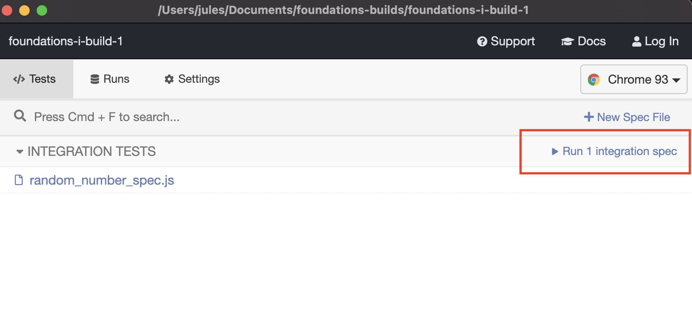

# Alchemy Bootstrap Template

## Making a plan

(bolded steps are mandatory, unbolded are for more advanced projects)

1) **Make a drawing of your app. Simple "wireframes"**
2) **Once you have a drawing, name the HTML elements you'll need to realize your vision**
3) **For each HTML element ask: Why do I need this?**
4) Ask which of out HTML elements are hard coded, and which are dynamically generated?
5) **Once we know _why_ we need each element, think about how to implement the "Why" as a "How"**
6) Is there some state we need to initialize?
7) **Find all the 'events' (user clicks, form submit, on load etc) in your app. Ask one by one, "What happens when" for each of these events. Does any state change?**
8) **Think about how to validate each of your steps**
9) Ask: should any of this work be abstracted into functions? (i.e., is the work complicated? can it be resused?)
10) Consider your data model. What objects will you be using? What are the key/value pairs? What arrays do you need? What needs to live in local storage?
11) **Consider what features _depend_ on what other features. Use this dependency logic to figure out what order to complete tasks.**

## To Run Cypress Tests
* `npm install`
* `npm test`
* Cypress will open -- you should then click "run <#> integration spec(s)"
    
* Make sure all tests pass

~~~~~~~~~~~~~~~~~~~~~~~~~~~~~~~~~~~~~~~~~~~~~~~~~~~~~~~~~~~~~~

PLANS day 2 (Lab-07)

new branch

1
make new folder ./cart
    index.html
    cart-data.js // holds temp checkout data
    render-cart.js

2
index.html
    build table for formating
        header - header stuff 
        body - quant, prod name, price, total
        footer - order total
    add 'place order' button
    make cart.css
        style table

ACP

3
new file in ./date/cart.js
    array of object for items in cart (test)
    export
ACP

4
export function findByID in /utils.js
    takes array, id. 
    returns first item that has .id === id
    no match return null (optional)
    may need expect.deepEqual for test

ACP

5
DOM render function
    ./cart/render-cart.js
    export function to gen table rows
    use html as guide
    create each dom element
    update test

ACP

6
gen shopping cart
    import data, DOM render, util function
    locate <tbody> element
    loop through cart

ACP

7
calcOrderTotal in utils.js
    variable for order total
    loop and calc each line
    return total
    add total to table